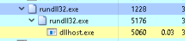
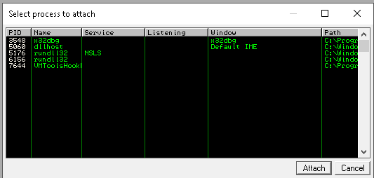
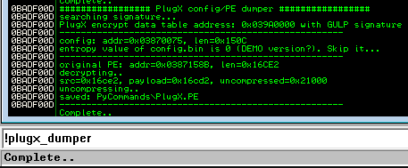

# Installing plugin for [ImmunityDebugger](https://www.immunityinc.com/products/debugger/)

1. Download `plugx_dumper.py`
2. Move the file to `"/path/to/Immunity Inc/Immunity Debugger/PyCommands"`

# Executing the plugin

1. Execute the PlugX Malware  
   

2. Open Immunity Debugger as administrator
3. Attach debugger (Ctrl+F1) to the PlugX malware  
   

4. Execute the plugx_dumper.py by running `!plugx_dumper` at the Python command line. The result is included in the image below  
   

5. The decrypted PlugX malware (this is running in memory) will be extracted in `"/path/to/Immunity Inc/Immunity Debugger/PyCommands"`